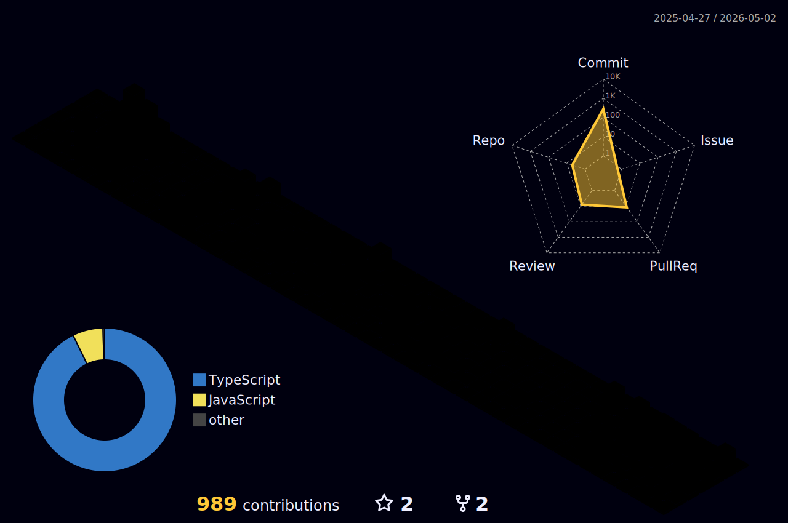

<!--
**YuriVini/YuriVini** is a ✨ _special_ ✨ repository because its `README.md` (this file) appears on your GitHub profile.

Here are some ideas to get you started:

- 🔭 I’m currently working on ...
- 🌱 I’m currently learning ...
- 👯 I’m looking to collaborate on ...
- 🤔 I’m looking for help with ...
- 💬 Ask me about ...
- 📫 How to reach me: ...
- 😄 Pronouns: ...
- ⚡ Fun fact: ...
-->

## Hey, I'm Yuri Vinicius, Mobile developer!

I'm a Senior Software Engineer from Brazil who has been working with React Native daily for over five years, giving me the experience to build high-quality solutions for a wide range of complex technical challenges. Throughout my career, I've had the opportunity to work on impactful projects such as:

As a Tech Lead, I led the architecture and technical evolution of [UAU CAIXA](https://uaucaixa.com.br/), CAIXA Bank's loyalty and rewards platform, building scalable mobile and backend solutions while driving accessibility, analytics, deep linking, AI-powered engineering tooling, and the delivery of more than 50 production features in just four months.

As a Senior Software Engineer, I helped build advanced iOS experiences for [MaxRewards](https://maxrewards.com/), implementing Live Activities with Location-Based Updates, Dynamic Island, Lock Screen Widgets, Control Center Widgets, and Apple's newest Liquid Glass design system to deliver contextual cashback experiences.

As a Software Engineer II, I led the refactoring of nearly 99% of the mobile application for one of Brazil's largest private-label card companies, successfully modernizing the app's architecture. [Cartão de TODOS](https://www.cartaodetodos.com.br/)

  
  

 
 

  <a href="https://github.com/YuriVini">
  
  

 
  
  
  
  
  
  
  
  
  
  
  
  
  
  

  
  ##
 

 
  
  
   

 
  <picture>
    <source media="(prefers-color-scheme: dark)" srcset="https://raw.githubusercontent.com/platane/platane/output/github-contribution-grid-snake-dark.svg">
    <source media="(prefers-color-scheme: light)" srcset="https://raw.githubusercontent.com/platane/platane/output/github-contribution-grid-snake.svg">
    
  </picture>

