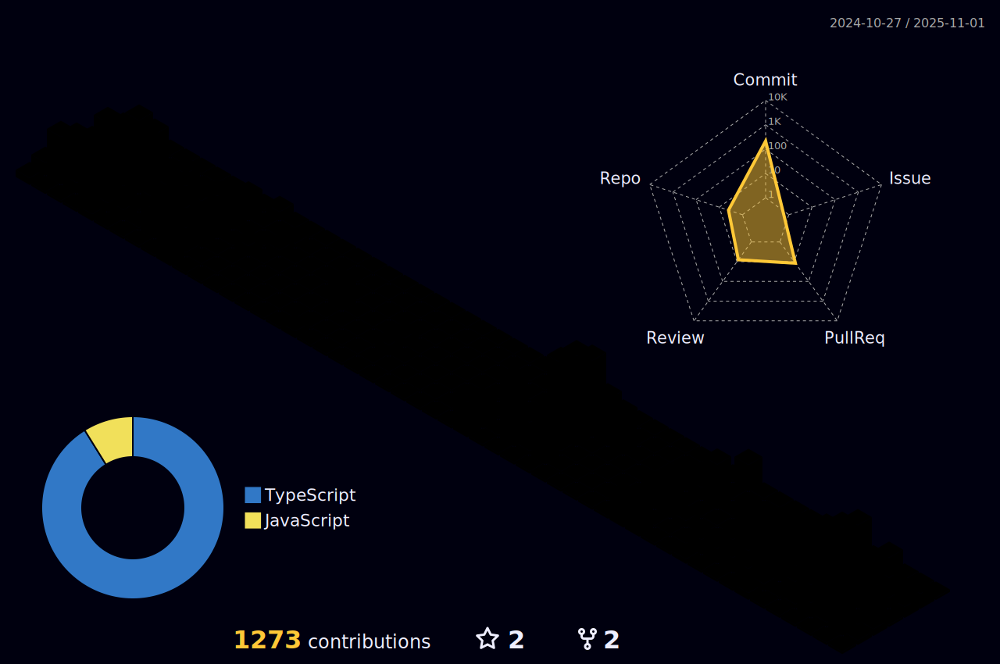

<!--
**YuriVini/YuriVini** is a ✨ _special_ ✨ repository because its `README.md` (this file) appears on your GitHub profile.

Here are some ideas to get you started:

- 🔭 I’m currently working on ...
- 🌱 I’m currently learning ...
- 👯 I’m looking to collaborate on ...
- 🤔 I’m looking for help with ...
- 💬 Ask me about ...
- 📫 How to reach me: ...
- 😄 Pronouns: ...
- ⚡ Fun fact: ...
-->

## Hey, I'm Yuri Vinicius, Mobile developer!

I'm a Senior Software Engineer from Brazil who has been working with React Native daily for five years, which has given me the experience to build high-quality solutions for the most diverse and complex problems. Throughout my career, I was able to get in touch with incredible challenges such as:

- As a Senior SWE, I had the mission to build and architect from scratch a platform of Video to watch classes offline for one of Brazil's biggest companies in the study segment. [Mindz](https://mindz.com.br/?utm_source=google&utm_medium=gerais01&utm_campaign=pesquisacaptacao&gclid=CjwKCAiA_aGuBhACEiwAly57MaEoFwE0HRyomfvCsJ-H6WZrp4bp28yOyn_y5onidbCAu7ztVC-sfBoCyv8QAvD_BwE)
- As a SWE II, I had the mission to refactor almost (99%) of the App of one of Brazil's biggest private-label card brands. An incredible case of success. [Cartão de TODOS](https://www.cartaodetodos.com.br/)
- As a SWE II, I had the mission to refactor all design and structure of the App for one of the biggest companies in the market segment. [Assai](https://www.assai.com.br/)

  
  

 
 

  <a href="https://github.com/YuriVini">
  
  

 
  
  
  
  
  
  
  
  
  
  
  
  
  
  

  
  ##
 

 
  
  
   

 
  <picture>
    <source media="(prefers-color-scheme: dark)" srcset="https://raw.githubusercontent.com/platane/platane/output/github-contribution-grid-snake-dark.svg">
    <source media="(prefers-color-scheme: light)" srcset="https://raw.githubusercontent.com/platane/platane/output/github-contribution-grid-snake.svg">
    
  </picture>

